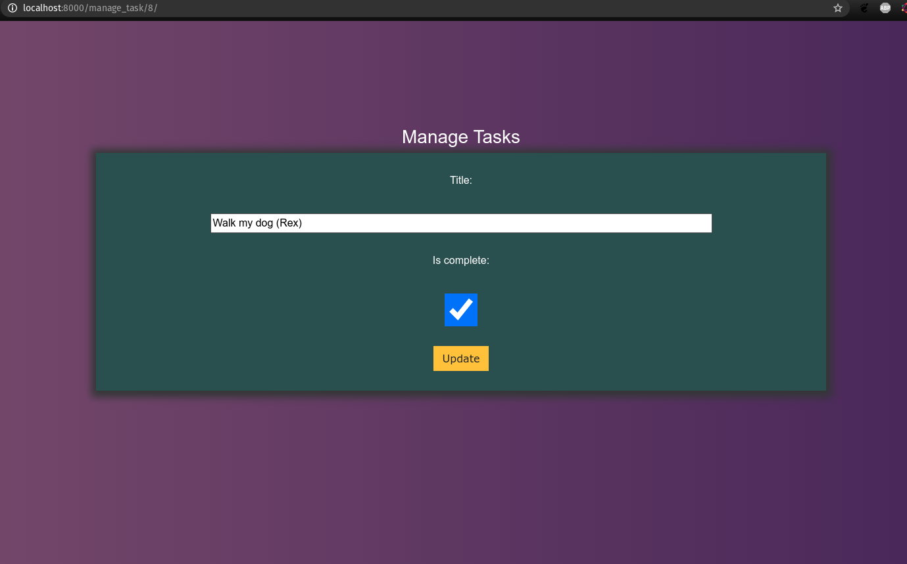
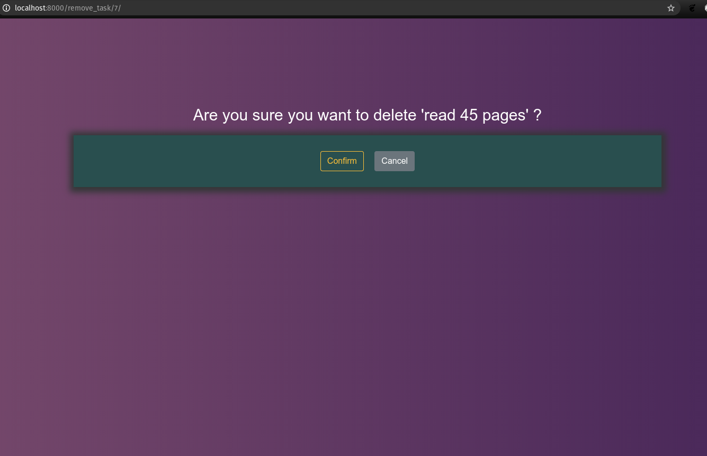

# Django-TodoActivity
This is an application built as a way of introducing myself to Django. The entire app is built using Django Framework and Django templates
### View of the application

### Adding a new task called "New Task"
### Updating a task to "Walk my dog(Rex)"
### removing a task "Reading 45 pages"

### Final Look

