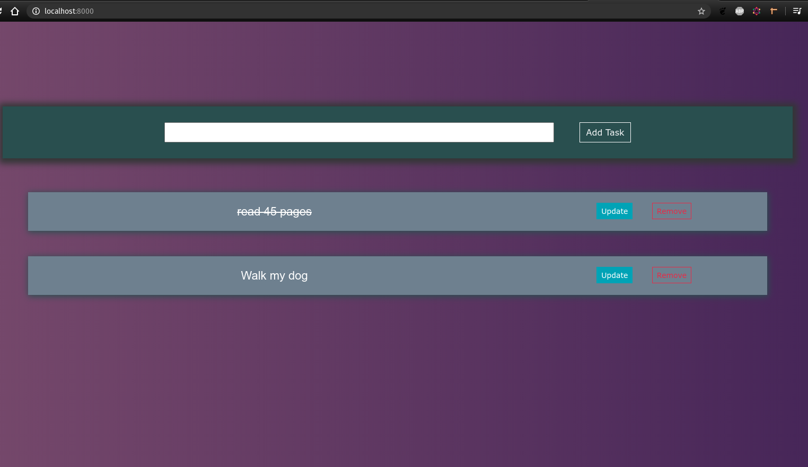
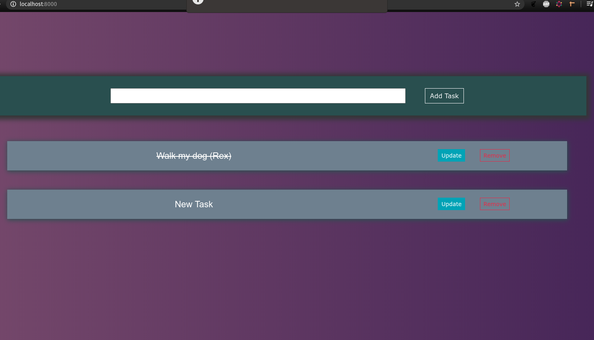

# Django-TodoActivity
This is an application built as a way of introducing myself to Django. The entire app is built using Django Framework and Django templates
### View of the application

### Adding a new task/ updating a task/ removing a task

### Final Look

